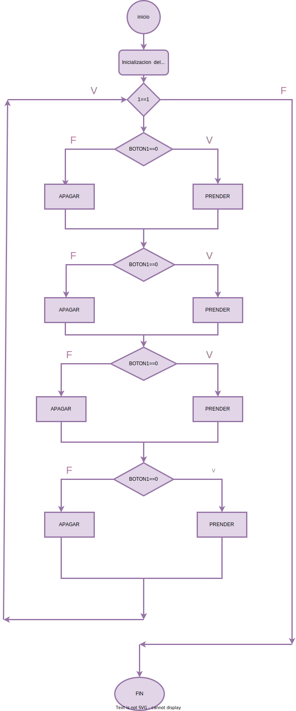

# TP1

## Uso de puertos de entrada y salida. 

Utilizando un Arduino Nano (`atmega328p`), `4 LEDs` y `4 Pulsadores` se pide:

1. Mediante el uso de un `pulsador` controle el estado de un `LED` de manera que si el pulsador elegido esta presionado entonces el LED elegido debe de estar encendido. De manera extensiva si el pulsador elegido NO esta presionado entonces el LED elegido debe de estar apagado. 

2.  Hacer extensivo el funcionamiento a los cuatro pulsadores, de manera que se controlen a los cuatro LEDs mediante los cuatro PULSADORES. 

> Nota: Todos los pulsadores `deben` tener habilitada la resistencia de `pull-up`

> Asi mismo los LEDs deben conectarse con su resistencia limitadora de corriente 2 asegurando no superar la corriente máxima que puede entregar el pin. Almenos de 330 Ohms


## ¡USAR LOS PINES INDICADOS NO CAMBIARLOS!

``` C
PD4 -> BOTON 1 
PD5 -> BOTON 2 
PD6 -> BOTON 3 
PD7 -> BOTON 4


PB0 -> LED 1 
PB1 -> LED 2 
PB2 -> LED 3 
PB3 -> LED 4
```


# INFORME:

- Este codigo esta programdo para prender y apagar 4 leds mediante 4 pulsadores 

---

``` c
#define bot1 ((PIND >> 4) & 0x01)
#define bot2 ((PIND >> 5) & 0x01)
#define bot3 ((PIND >> 6) & 0x01)
#define bot4 ((PIND >> 7) & 0x01) 
```
- En esta seccion estoy definiendo un nombre para cada boton para hacer más rapida la escritura del codigo 

``` c 
#define prender(PORT, PIN) (PORT |= 1 << PIN)
#define apagar(PORT, PIN) (PORT &= ~(1 << PIN))
```
- Y en esta parte estoy definiendo el prendido y apagado de cada led 

``` C
DDRD &= 0x0F;
DDRB |= 0x0F;
``` 
- Aca condiguré mis pines como entrada y salida 

``` C
  while(1){
    if (bot1==0)
    {
      prender(PORTB,0);
    }
    else{
     apagar(PORTB,0);
    }

    if (bot2==0)
    {
      prender(PORTB,1);
    }
    else{
    apagar(PORTB,1);
     
    }

    if (bot3==0)
    {
      prender(PORTB,2);
    }
    else{
    apagar(PORTB,2);
    }

    if (bot4==0)
    {
      prender(PORTB,3);
    }
    else{
    apagar(PORTB,3);
    }
  }
  ```
  - En esta parte abri un while indicar que el codigo se repita infinitamente , y adentro del while abri 4 if para indicar que si el el boton de el puerto tal esta presionado el led numero tal esta encendido

# Diagrama de Flujo

